<h1 align='center'>AnyGraph: Graph Foundation Model in the Wild</h1>

<div align='center'>
<a href='https://arxiv.org/pdf/2408.10700'></a>
<!-- <a href=''></a> -->
<!-- <a href=''></a> -->


<a href='https://akaxlh.github.io/'>Lianghao Xia</a> and <a href='https://sites.google.com/view/chaoh/group-join-us'>Chao Huang</a>

**Introducing AnyGraph, a graph foundation model designed for zero-shot predictions across domains.**


</div>

**Objectives of AnyGraph:**

- **Structure Heterogeneity**: Addressing distribution shift in graph structural information.
- **Feature Heterogeneity**: Handling diverse feature representation spaces across graph datasets.
- **Fast Adaptation**: Efficiently adapting the model to new graph domains.
- **Scaling Law Emergence**: Performance scales with the amount of data and model parameters.

<br>

**Key Features of AnyGraph:**

- **Graph Mixture-of-Experts (MoE)**: Effectively addresses cross-domain heterogeneity using an array of expert models.
- **Lightweight Graph Expert Routing Mechanism**: Enables swift adaptation to new datasets and domains.
- **Adaptive and Efficient Graph Experts**: Custom-designed to handle graphs with a wide range of structural patterns and feature spaces.
- **Extensively Trained and Tested**: Exhibits strong generalizability over 38 diverse graph datasets, showcasing scaling laws and emergent capabilities.

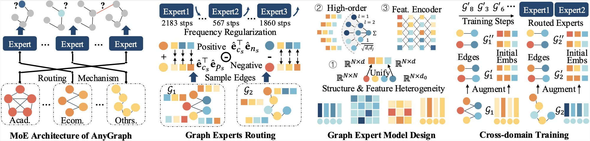

## News
- [x] 2024/09/18 Fix minor bugs on loading and saving path, class names, etc.
- [x] 2024/09/11 Datasets are available now!
- [x] 2024/09/11 Pre-trained models are available on huggingface now!
- [x] 2024/08/20 Paper is released.
- [x] 2024/08/20 Code is released.

## Environment Setup
Download the data files at <a href='https://huggingface.co/datasets/hkuds/AnyGraph_datasets'>this link</a>. And fill in your own directories for data storage at function `get_data_files(self)` of class `DataHandler` in the file `data_handler.py`.

Download the pre-trained AnyGraph models at <a href='https://huggingface.co/hkuds/AnyGraph/'>hugging face</a> or <a href='https://hkuhk-my.sharepoint.com/:u:/g/personal/lhaoxia_hku_hk/Efmm5TJm0B5EnmYzTqg8GWEB1loKzeIR5tcr3hPIOJDXXA?e=2wMgZC'>one drive</a>, and put it into `Models/`.

**Packages**: Our experiments were conducted with the following package versions:
* python==3.10.13
* torch==1.13.0
* numpy==1.23.4
* scipy==1.9.3

**Device Requirements**: The training and testing of AnyGraph requires only one GPU with 24G memory (e.g. 3090, 4090). Using larger input graphs may require devices with larger memory.

## Code Structure
Here is a brief overview of the code structures. The explanations for each directory are enclosed in quotes (##...##).
```
./
│   ├── .gitignore
│   ├── README.md
│   ├── data_handler.py ## load and process data
│   ├── model.py ## implementation for the model
│   ├── params.py ## hyperparameters
│   └── main.py ## main file for pretraining and link prediction
│   ├── History/ ## training and testing logs
│   │   ├── pretrain_link1.his
│   │   └── pretrain_link2.his
│   ├── Models/ ## pre-trained models
│   │   └── README.md
│   ├── Utils/ ## utility function
│   │   └── TimeLogger.py
│   ├── imgs/ ## images used in readme
│   │   ├── ablation.png
│   │   ├── article cover.png
│   │   ├── datasets.png
│   │   ├── framework_final.jpeg
│   │   ├── framework_final.pdf
│   │   ├── framework_final.png
│   │   ├── overall_performance2.png
│   │   ├── routing.png
│   │   ├── scaling_law.png
│   │   ├── training_time.png
│   │   ├── tuning_steps.png
│   │   └── overall_performance1.png
│   ├── node_classification/ ## test code for node classification
│   │   ├── data_handler.py
│   │   ├── model.py
│   │   ├── params.py
│   │   └── main.py
│   │   ├── Utils/
│   │   │   └── TimeLogger.py
```

## Usage
To reproduce the test performance reported in the paper, run the following command lines:
```
# Test on Link2 and Link1 data, respectively
python main.py --load pretrain_link1 --epoch 0 --dataset link2 
python main.py --load pretrain_link2 --epoch 0 --dataset link1

# Test on the Ecommerce datasets in the Link2 and Link1 group, respectively.
# Testing on Academic and Others datasets are conducted similarily.
python main.py --load pretrain_link1 --epoch 0 --dataset ecommerce_in_link2
python main.py --load pretrain_link2 --epoch 0 --dataset ecommerce_in_link1

# Test the performance for node classification datasets
cd ./node_classification
python main.py --load pretrain_link2 --epoch 0 --dataset node
```

To re-train the two models by yourself, run:
```
python main.py --dataset link2+link1 --save pretrain_link2
python main.py --dataset link1+link2 --save pretrain_link1
```

## Datasets

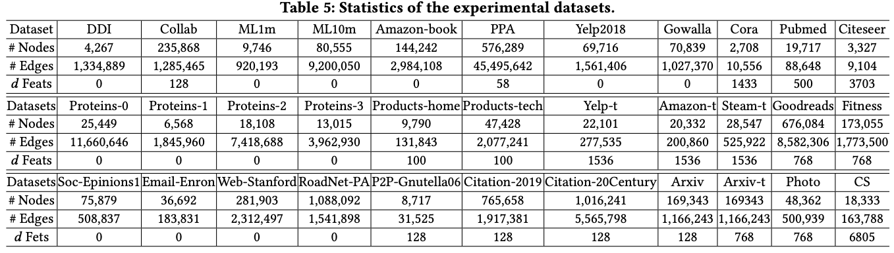

The statistics for the experimental datasets are presented in the table above. We categorize them into distinct groups as below. Note that Link1 and Link2 include datasets from different sources, and the datasets do not share the same feature spaces. This separation ensures a robust evaluation of true zero-shot performance in graph prediction tasks.

| Group | Included Datasets |
| ----- | ----- |
| Link1 | Products-tech, Yelp2018, Yelp-textfeat, Products-home, Steam-text, Amazon-text, Amazon-book, Citation-2019, Citation-20Century, Pubmed-link, Citeseer, OGB-PPA, P2P-Gnutella06, Soc-Epinions1, Email-Enron |
| Link2 | Photo, Goodreads, Fitness, Movielens-1M, Movielens10M, Gowalla, Arxiv, Arxiv-t, Cora, CS, OGB-Collab, Proteins-0, Proteins- 1, Proteins-2, Proteins-3, OGB-DDI, Web-Stanford, RoadNet-PA |
| Ecommerce | Products-tech, Yelp2018, Yelp-textfeat, Products-home, Steam-text, Amazon-text, Amazon-book, Photo, Goodreads, Fitness, Movielens-1M, Movielens10M, Gowalla |
| Academic | Citation-2019, Citation-20Century, Pubmed-link, Citeseer, OGB-PPA, Arxiv, Arxiv-t, Cora, CS, OGB-Collab |
| Others | P2P-Gnutella06, Soc-Epinions1, Email-Enron, Proteins-0, Proteins- 1, Proteins-2, Proteins-3, OGB-DDI, Web-Stanford, RoadNet-PA |
| Node | Cora, Arxiv, Pubmed, Home, Tech |


## Experiments

### Model Pre-Training Curves
We present the training logs with respect to epochs below. Each figure contains two curves, each corresponding to two instances of repeated pre-training.

- pretrain_link1

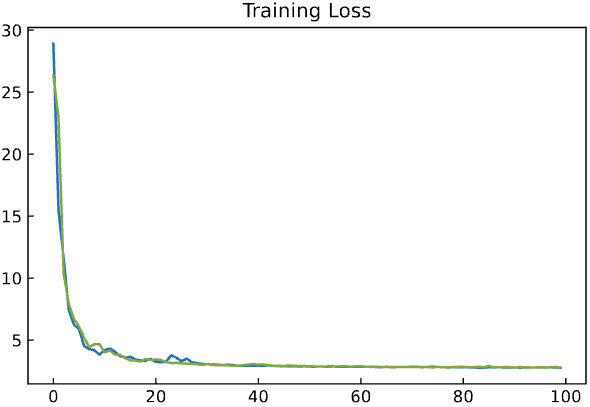&nbsp;
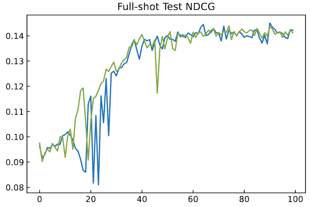&nbsp;
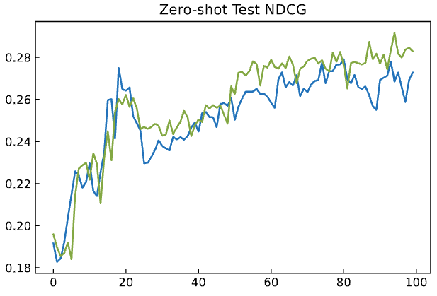

- pretrain_link2

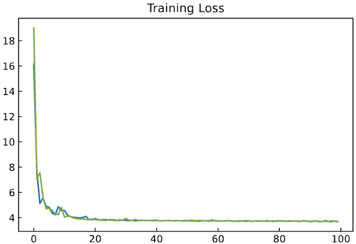&nbsp;
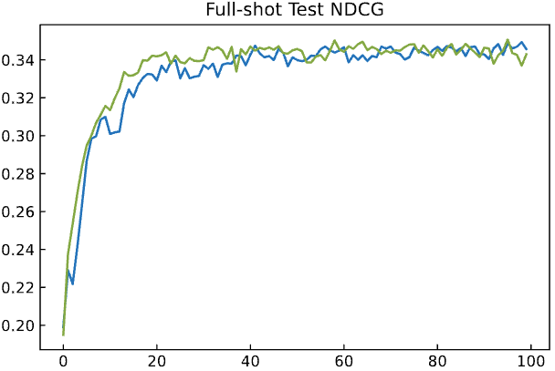&nbsp;
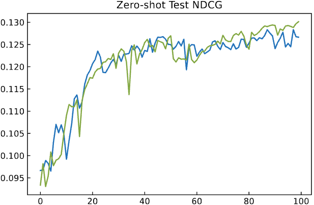

### Overall Performance Comparison

- Comparing to few-shot end2end models and pre-training and fine-tuning methods.
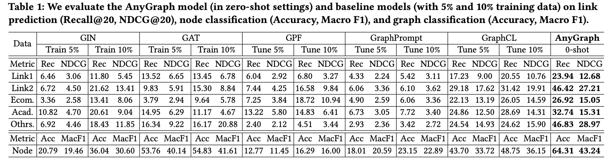

- Comparing to zero-shot graph foundation models.
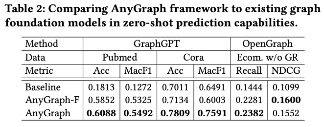

### Scaling Law of AnyGraph

We explore the scaling law of AnyGraph by evaluating 1) model performance v.s. the number of model parameters, and 2) model performance v.s. the number of training samples. 

Below shows the evaluation results on 
- all datasets across domains (a)
- academic datasets (b)
- ecommerce datasets (c)
- other datasets (d) 

In each subfigure, we show 
- zero-shot performance on unseen datasets w.r.t. the amount of model parameters (left)
- full-shot performance on training datasets w.r.t. the amount of model parameters (middle)
- zero-shot performance w.r.t. the amount of training data (right)

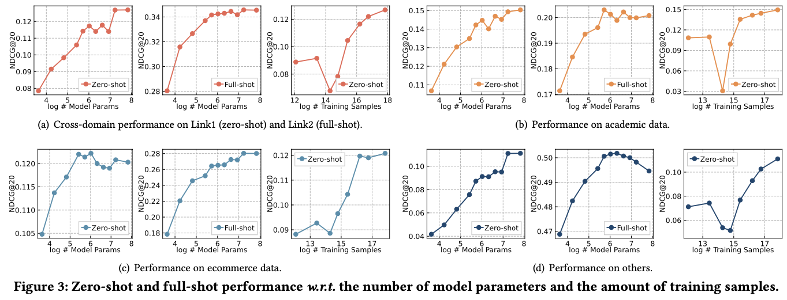

The outcome outlines the following key observations: (see Sec. 4.3 for details)
- Generalizability of AnyGraph Follows the Scaling Law.
- Emergent Abilities of AnyGraph.
- Insufficient Training Data May Bring Bias.

### Ablation Study

The ablation study investigates the impact of the following modules:
- The overall MoE architecture
- Frequency regularization in the expert routing mechanism
- Graph augmentation in the learning process
- The utilization of (heterogeneous) node features from different datasets
  
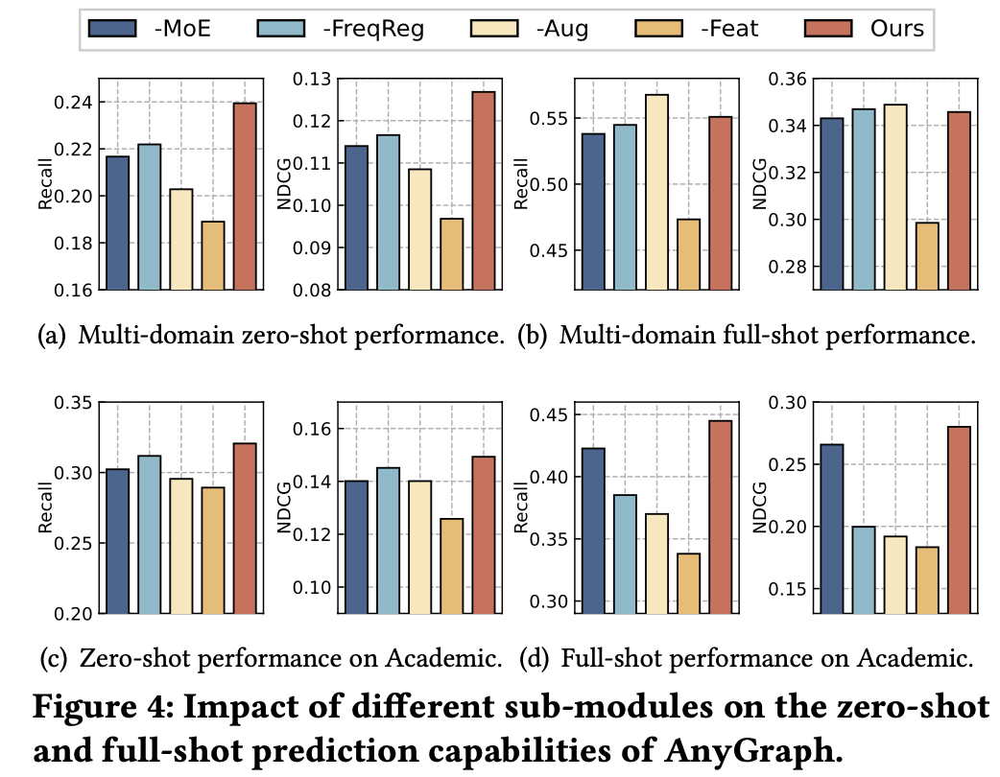


### Expert Routing Mechanism
We visualize the competence scores between datasets and experts, given by the routing algorithm of AnyGraph. 

The resulting scores below demonstrates the underlying relatedness between different datasets, thus demonstrating the intuitive effectiveness of the routing mechanism. (see Sec. 4.5 for details)

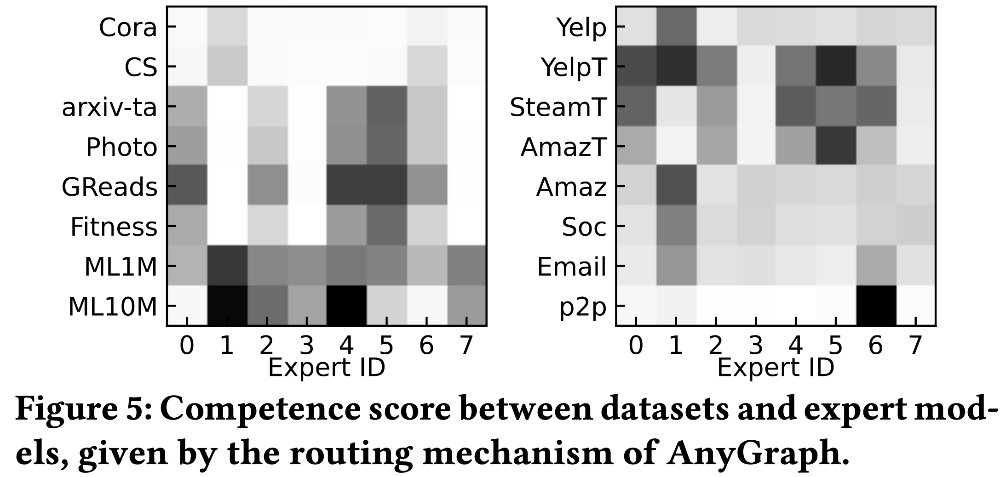


### Fast Adaptation of AnyGraph

We study the fast adaptation abilities of AnyGraph from two aspects:
- When fine-tuned on unseen datasets, AnyGraph achieves better performance with less training steps. (Fig. 6 below)
- The training time of AnyGraph is comparative to that of other methods. (Table 3 below)

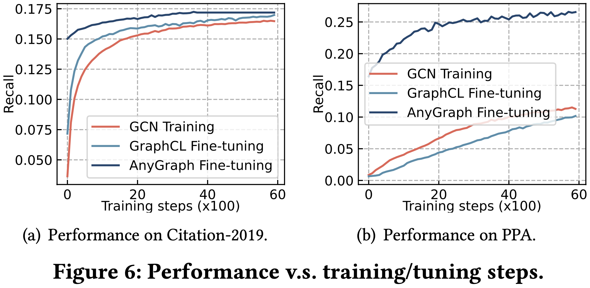

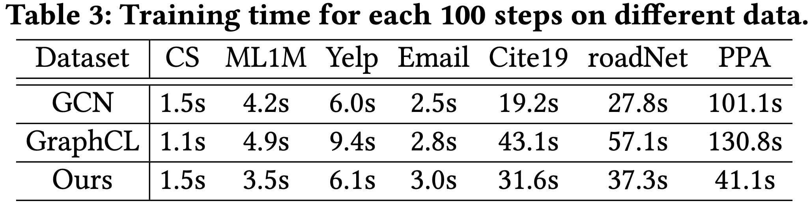

## Citation

If you find our work useful, please consider citing our paper:
```
@article{xia2024anygraph,
  title={AnyGraph: Graph Foundation Model in the Wild},
  author={Xia, Lianghao and Huang, Chao},
  journal={arXiv preprint arXiv:2408.10700},
  year={2024}
}
```
